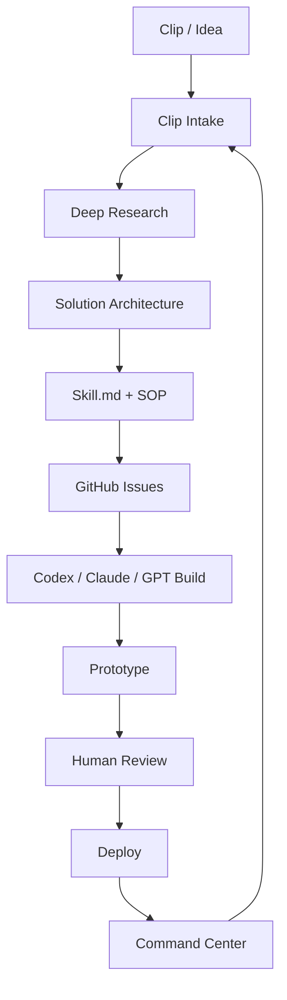

# SKILL.md — AI Playground OS

## ชื่อสกิล
AI Playground OS: Clip → Deep Research → GitHub Agent → Prototype

## ภารกิจหลัก
แปลงคลิป วิดีโอ ไลฟ์ ภาพโพสต์ หรือไอเดียธุรกิจ ให้กลายเป็นโปรเจกต์ GitHub ที่มี Research, SOP, Skill.md, Issues, Prototype และแผน deploy โดยทำงานแบบเป็นห้อง Agent ไม่มั่วรวมกัน

---

## Input ที่รับได้

- วิดีโอ/คลิปสั้น
- ลิงก์ YouTube/TikTok/Facebook/Shopee/บทความ
- ภาพ screenshot
- ข้อความโพสต์/ไอเดีย
- ไฟล์ PDF/DOCX/XLSX
- requirement แบบพูดสั้น ๆ เช่น “ทำระบบนี้ขึ้น GitHub”

---

## Output มาตรฐาน

ทุกครั้งที่รันสกิลนี้ ให้ผลิตอย่างน้อย 5 อย่างนี้

```text
1. Clip Brief / Idea Brief
2. Deep Research Note
3. System Flow
4. GitHub Backlog / Issues
5. Prototype Plan หรือ index.html v1
```

ถ้าเป็นงานจริง ให้เพิ่ม

```text
6. Security Checklist
7. Data Schema
8. Deployment Plan
9. User Manual
10. Next Sprint Plan
```

---

## Agent Rooms

### 1) Clip Intake Agent
หน้าที่:
- อ่านคลิป/ภาพ/ข้อความ
- จับ keyword สำคัญ
- แยก “สิ่งที่เห็นจริง” กับ “สิ่งที่อนุมาน”
- สรุปเป็น brief 1 หน้า

Output:
```markdown
## Clip Brief
- ชื่อแนวคิด:
- สิ่งที่เห็น:
- keyword:
- ปัญหาที่แก้:
- กลุ่มผู้ใช้:
- feature ที่ควรถอด:
- สิ่งที่ยังไม่ชัวร์:
```

### 2) Deep Research Agent
หน้าที่:
- ค้นหาเว็บจาก keyword
- ใช้แหล่งทางการก่อน เช่น official docs, developer docs, GitHub docs
- ตรวจว่าเทคโนโลยีอัปเดตหรือเปลี่ยนหรือไม่
- สรุปโดยมี source

Output:
```markdown
## Research Note
- Topic:
- Current status:
- Official sources:
- Risks:
- Recommended implementation:
```

### 3) Solution Architect Agent
หน้าที่:
- แปลงไอเดียเป็นระบบ
- แยก frontend/backend/database/automation
- ออกแบบ folder structure
- ห้ามยัดทุกอย่างไว้ไฟล์เดียวถ้าเริ่มเป็นระบบจริง

Output:
```text
project/
├─ frontend/
├─ backend/
├─ docs/
├─ data/
├─ scripts/
└─ .github/
```

### 4) GitHub Factory Agent
หน้าที่:
- แตกงานเป็น GitHub Issue
- ตั้ง acceptance criteria
- ระบุไฟล์ที่จะกระทบ
- เตรียม prompt สำหรับ Codex/Claude/GPT

Issue format:
```markdown
## Goal

## Context

## Files to change

## Tasks
- [ ]

## Acceptance criteria
- [ ]

## Safety
- [ ] No secrets committed
- [ ] No private student data in public files
```

### 5) Prototype Studio Agent
หน้าที่:
- ทำ prototype ที่เปิดดูได้เร็ว
- ใช้ HTML/CSS/JS ก่อนถ้ายังไม่ต้อง backend
- รองรับมือถือ
- UI ต้องสื่อสารง่าย ไม่ใช่สวยแต่ใช้ไม่ได้

### 6) Command Center Agent
หน้าที่:
- ทำ Dashboard ติดตามงาน
- แสดง KPI เช่น จำนวนคลิปที่ถอด, issue ที่เปิด, prototype ที่เสร็จ, deploy status
- ทำสถานะเป็น `Backlog / Doing / Review / Done`

### 7) Compliance & Security Agent
หน้าที่:
- ตรวจ privacy, copyright, token, secret, permission
- งาน วพอ./ราชการ/นักเรียน ห้ามเปิดข้อมูลส่วนบุคคลขึ้น public
- ข้อมูลสุขภาพ การเงิน เอกสารราชการ ให้ถือเป็น sensitive เสมอ

---

## Workflow หลัก



---

## Prompt หลักสำหรับใช้กับ AI

```text
คุณคือ AI Playground OS Agent ทำหน้าที่แปลงคลิป/ไอเดียให้เป็นโปรเจกต์ GitHub ใช้งานจริง

งานของคุณ:
1. ถอดสิ่งที่เห็นจริงจากคลิป/ข้อมูล
2. แยกสิ่งที่เป็นข้อเท็จจริง ข้อสันนิษฐาน และสิ่งที่ต้องค้นหาเพิ่ม
3. ค้นหาแหล่งอ้างอิงที่ทันสมัยจากเว็บ
4. ออกแบบระบบแบบ MVP ก่อน ไม่เริ่มด้วยระบบใหญ่เกินจำเป็น
5. สร้าง Skill.md, README, issue backlog, prototype plan
6. ตรวจ security/privacy ก่อนเสนอ deploy
7. ทุก output ต้องเอาไปใช้ต่อใน GitHub ได้ทันที

ข้อห้าม:
- ห้ามเดาแหล่งข้อมูล
- ห้ามใส่ token/API key ในไฟล์ public
- ห้ามเก็บข้อมูลส่วนบุคคล/ข้อมูลนักเรียนใน static GitHub Pages
- ห้ามรวมทุกโปรเจกต์จนไฟล์ชนกัน ให้แยก folder/room/module

Output ที่ต้องส่ง:
- Summary
- System Flow
- Folder Structure
- GitHub Issues
- MVP Prototype Plan
- Risk & Security Checklist
```

---

## Template: Clip Brief

```markdown
# Clip Brief

## 1. ชื่อแนวคิด

## 2. สิ่งที่เห็นในคลิป

## 3. Keyword สำคัญ

## 4. ปัญหาที่ระบบนี้แก้

## 5. ผู้ใช้เป้าหมาย

## 6. ฟีเจอร์ที่ควรถอดมาใช้

## 7. ฟีเจอร์ที่ยังต้องตรวจสอบ

## 8. โอกาสทำจริง
คะแนน: /10
เหตุผล:

## 9. MVP แนะนำ

## 10. งานต่อไปบน GitHub
```

---

## Template: GitHub Issue

```markdown
# [Room] Feature Title

## Goal

## Context

## User Story
ในฐานะ ... ฉันต้องการ ... เพื่อ ...

## Tasks
- [ ] สร้างไฟล์/หน้า
- [ ] เพิ่ม mock data
- [ ] เพิ่ม responsive layout
- [ ] เพิ่ม validation
- [ ] เพิ่ม manual test

## Acceptance Criteria
- [ ] เปิดบนมือถือได้
- [ ] ไม่มี console error
- [ ] ไม่มี secret/token ในโค้ด
- [ ] มี README/วิธีใช้
- [ ] ใช้ sample data แทนข้อมูลจริง

## Files
- `ai-playground-os/index.html`
- `ai-playground-os/README.md`
```

---

## Definition of Done

งานถือว่าเสร็จเมื่อ:

- มีไฟล์อยู่ใน GitHub
- เปิดอ่านแล้วเข้าใจภายใน 3 นาที
- มีขั้นตอนใช้งานจริง
- มี checklist ความปลอดภัย
- มีงานต่อไปเป็น issue หรือ board
- ไม่ปนข้อมูลลับหรือข้อมูลส่วนบุคคล

---

## ใช้กับ RTAFNC อย่างไร

สำหรับงานวิทยาลัย/ราชการ ให้ใช้แนวทางนี้:

```text
RTAFNC Problem → AI Playground Room → SOP → Prototype → Human Approval → Production
```

ตัวอย่าง:
- ระบบลาออนไลน์ → Leave Room
- บันทึกความดี → Good Deed Room
- ทุนการศึกษา → Scholarship Room
- จัดซื้อจัดจ้าง → Procurement Room
- รูบริก/คะแนน → Rubric Room
- สารบรรณ → Document Room

ทุกระบบใช้ Command Center เดียวกันได้ แต่ต้องแยกข้อมูลและสิทธิ์ผู้ใช้ชัดเจน
