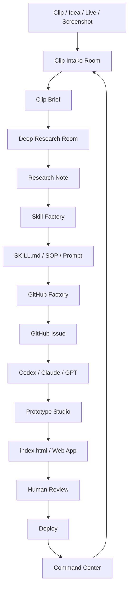
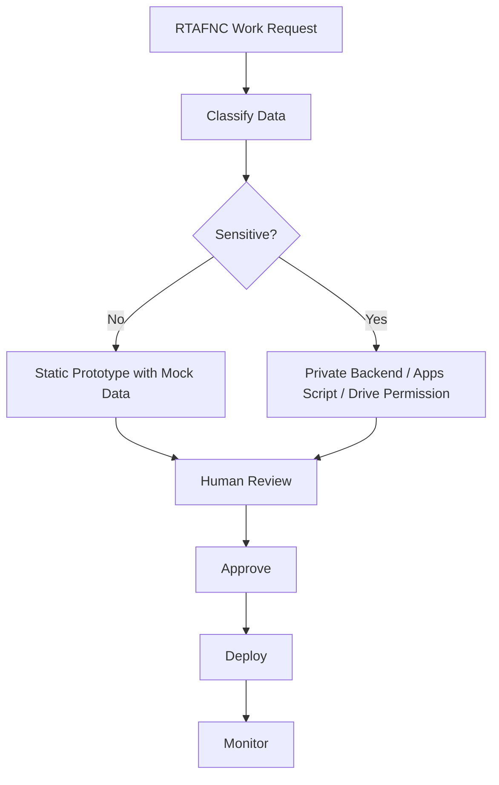

# workflow-map.md — AI Playground OS Flow

แผนภาพการทำงานรวมของโปรเจกต์ Clip → Research → GitHub Agent → Prototype

---

## Main Flow



---

## RTAFNC Safe Flow



---

## Data Boundary

| Layer | ใช้ทำอะไร | ข้อมูลที่อนุญาต |
|---|---|---|
| GitHub Pages | prototype / demo / dashboard mock | mock data, public docs |
| GitHub Issues | task / acceptance criteria | requirement, non-sensitive summary |
| Google Apps Script | backend / workflow | controlled data with permission |
| Google Drive | files / evidence | private folder permission |
| LINE LIFF | user interaction | auth-bound user data |
| Command Center | status / KPI | aggregated / anonymized data |

---

## Standard Sprint Loop

```text
1. Intake: รับคลิป/ไอเดีย
2. Brief: ถอดเป็น Clip Brief
3. Research: ตรวจแหล่งข้อมูล
4. Plan: เขียน flow + folder + issue
5. Build: ให้ AI coding agent ทำเฉพาะ issue
6. Review: ตรวจมือถือ/console/security
7. Deploy: เปิดหน้า GitHub Pages หรือ backend
8. Improve: เก็บ feedback กลับเข้า board
```

---

## What Not To Do

- ห้ามเอา token/API key ใส่ใน `index.html`
- ห้ามใช้ GitHub Pages เก็บข้อมูลจริง
- ห้ามสร้าง issue ใหญ่แบบ “ทำทั้งหมดให้เสร็จ”
- ห้ามปล่อย AI แก้ทั้ง repo โดยไม่จำกัดไฟล์
- ห้ามให้ระบบอนุมัติข้อมูล sensitive อัตโนมัติโดยไม่มีคนตรวจ

---

## Next Workflow Upgrade

1. เพิ่ม localStorage ให้หน้า prototype จำข้อมูลได้ในเครื่อง
2. เพิ่ม export/import JSON
3. เพิ่ม print/export markdown
4. เพิ่ม GitHub issue copy format หลายแบบ
5. แยก `app.js` และ `styles.css` เมื่อ prototype ใหญ่ขึ้น
6. ต่อ Apps Script เฉพาะเมื่อ workflow นิ่งแล้ว
